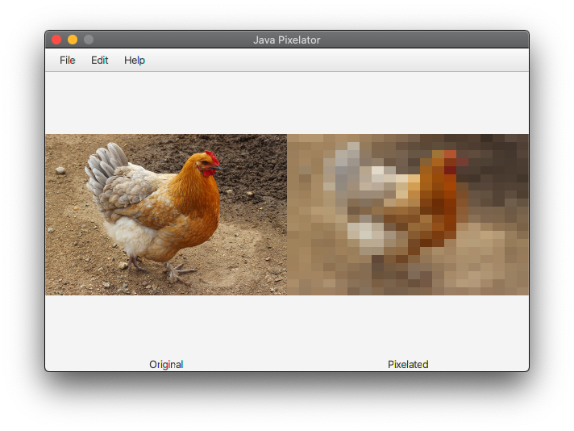

# javafx-pixelator
A simple program that pixelates images

## Releases
For the most up to date releases, please see the [releases](https://github.com/MyYogurt/javafx-pixelator/releases) section

All releases require at least the Java 8 Runtime Environment
